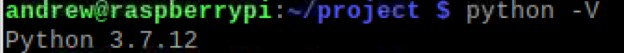
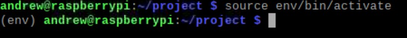
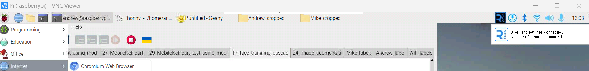
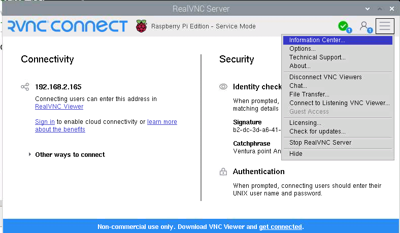

#### Prepared by Andrew Palmertree for Senior Project Group Fall 2023

# Virtual Environment and Dependencies Setup
### This guide will allow you to install tensorflow 2.5.0, Keras 2.4.3, and opencv 4.7.0.72

### Note, using VNC and WinSCP will help you setup and use your reaspberry pi in the future. Instructions on how to setup VNC are at the bottom.

## 1. Project Initial Setup
### This step will get the raspberry pi working before installing the packages we need for the machine learning environment

#### This is import first step:
Make sure you have the latest version of the Raspberry Pi OS. As of creating this I am using Bullseye 11:

```$cat /etc/os-release```

Look for the version_id and version to see what version of the OS you are running. If you are not running the lastest OS then stop and install and flash the newest OS version onto your Pi.

#### If we decide we are not using a USB camera but the socket camera you can enable it by following these steps:

1. ```$sudo raspi-config ```
2. Select option one "1 System Options"
3. Selcet option one "I1 Legacy Camera"
4. Select Enable

#### Now update your system:
```
$sudo apt-get update 
$sudo apt-get upgrade 
```
and then restarted the Pi to update all the packages installed.

#### Downgrade Python Version to 3.7.12
The next step in setting up the Raspberry Pi is to ensure that the dependencies and packages are compatible with each other. To achieve this, I downgraded Python to version 3.7.12. To do so, I ran the following commands: 

```
# Downloads Pyenv tool script and runs it in bash
$ curl https://pyenv.run | bash
$ sudo nano ~/.bashrc 
```

In the .bashrc file, I added the following lines at the end of the file: 
```
# adds /.pyenv/bin directory to your PATH environment variable
export PATH="$HOME/.pyenv/bin:$PATH" 
```
Pyenv is initialized and the shell's PATH and other environment variables are modified to prepare the shell for usage with Pyenv's shims. 

```
eval "$(pyenv init --path)"

# used to manage virtual environments
eval "$(pyenv virtualenv-init -) 
 ```

 I then restarted the terminal and installed the following packages: 
 
 ```
 $ sudo apt-get install --yes libssl-dev zlib1g-dev libbz2-dev libreadline-dev libsqlite3-dev llvm libncurses5-dev libncursesw5-dev xz-utils tk-dev libgdbm-dev lzma lzma-dev tcl-dev libxml2-dev libxmlsec1-dev libffi-dev liblzma-dev wget make opens 
 ```

Next, I updated pyenv and installed python 3.7.12: 
```
$ pyenv update
$ pyenv install –list
$ pyenv install 3.7.12 
```

After installing python 3.7.12, I set my project folder to python 3.7.12 with the following commands: 

```
$ mkdir project
$ cd project
$ pyenv local 3.7.12
$ python -V 
```
I got the following results from running python -V.



## 2. Install and activate the virtual environment
We want to create a virtual environment so that we can isolate the Python environment and install specific packages for the project without affecting the root environment. Virtual environments are particularly useful for testing, creating backups, and enhancing security. To create a virtual environment for our real-time handwritten recognition project, I used the following commands:

```
// Creates the virtual environment
$ python3 -m pip install virtualenv
$ python3 -m virtualenv env

// activate the environment
$ source env/bin/activate 
```

Then I installed some necessary dependencies: 

```
$ sudo apt-get install -y libhdf5-dev libc-ares-dev libeigen3-dev gcc gfortran libgfortran5 libatlas3-base libatlas-base-dev libopenblas-dev libopenblas-base libblas-dev liblapack-dev cython3 libatlas-base-dev openmpi-bin libopenmpi-dev python3-dev build-essential cmake pkg-config libjpeg-dev libtiff5-dev libpng-dev libavcodec-dev libavformat-dev libswscale-dev libv4l-dev libxvidcore-dev libx264-dev libfontconfig1-dev libcairo2-dev libgdk-pixbuf2.0-dev libpango1.0-dev libgtk2.0-dev libgtk-3-dev libhdf5-serial-dev libhdf5-103 libqt5gui5 libqt5webkit5 libqt5test5 python3-pyqt5 
```

After installing the necessary dependencies, we can activate the virtual environment in the project directory by using the following command:

```
$source env/bin/activate
```

Below is a demonstration that the virtual environment can be activated through the project directory.



## 3. Installing Packages in Virtual Environment 
Next, we must install the packages required for the virtual environment.To install TensorFlow, I used WinSCP software to transfer a file called tensorflow-2.5.0-cp37-none-linux_armv7l.whl from my laptop to the Raspberry Pi project folder. The wheel file contains all the necessary files to install TensorFlow 2.5.0 on an ARM7L embedded system.

you can get the tensorflow 2.5.0 file from here:
https://drive.google.com/uc?export=download&id=10rNYmGu2V9PFCcSRUEp_6H8j9WeKPusR

Now transfer that file to your rasberry pi's projecy folder.

To verify that TensorFlow file is in your project directory use the following command in the project directory: 

```
$ls | grep tensorflow* 
```

Now use the wheel file to install TensorFlow. 
```
# uninstall any previous versions of TensorFlow
$ python3 -m pip uninstall tensorflow

# Install TensorFlow 2.5.0 with the wheel file
$ python3 -m pip install tensorflow-2.5.0-cp37-none-linux_armv7l.whl

# Once TensorFlow is installed, I ran the following command to solve a compatibility issue: (This was needed for tensorflow 2.4.0, for tensorflow 2.5.0 I would still try running the following command solve any issues that come up)

$ pip uninstall h5py; HDF5_VERSION=1.10.6 pip install --no-binary=h5py h5py==3.1.0

# two issues that I ran into and helped fix the dependency errors was the following commands

$ pip uninstall platformdirs
$ pip install platformdirs==2.5.0

$ pip uninstall typing-extensions
$ pip install typing-extensions==3.7.4

# Fix any other dependency issues you may have before going forward.
```


#### I then installed OpenCV:
#### Note the following
#### Time command keeps track how long your command is running and will print the results at the end
#### There are many version of opencv
1. opencv-python
2. opencv-contrib-python
3. opencv-python-headless
4. opencv-contrib-python-headless
#### Options 3 and 4 are for server (headless) environments
#### Options 1 and 2 for standard desktop environments
#### opencv-python: Main modules
#### opencv-contrib-python: Full package which contains both main modules and extra modules
#### for the cascade facial recognition we need the opencv-contrib-python:
```
# Install opencv-contrib-python (took 152 minutes on the raspberry pi 4)
# As long as there is no error and says building the wheel then just keep waiting
$ time python3 -m pip install "opencv-contrib-python<4.8"


I then upgrade numpy to be compatible with cv2.
$ pip install --upgrade numpy

# Now that TensorFlow and OpenCV is installed, I verified that I could import them by running the following commands in the Python3 shell:
$ python3 // run in the command prompt to open up the Python shell
>>> import tensorflow as tf
>>> tf._version_
>>> import cv2
>>> cv2._version_
# to exit run exit() or quit()
```

If you are using the a pi camera install their packages:
```
# install picamera package
$ pip install picamera
```

Now to install Keras for Tensorflow 2.5.0:
```
$ pip uninstall keras
$ pip install keras==2.4.3

Make sure everything is working with no errors:
$ python3 // run in the command prompt to open up the Python shell
>>> import tensorflow as tf
>>> tf._version_
>>> import cv2
>>> cv2._version_
>>> import keras
>>> import numpy as np
# to exit run exit() or quit()
```

## 4. (optional) Setting up VNC to see you raspberry pi display on your laptop

Make sure VNC is on your Pi. There should be an icon on the top right with the big "R" symbol or go to the "internet" tab at the top left and click VNC viewer. 
If VNC viewer is not shown then follow a online guide to install VNC viewer sever on the Pi. It should already be installed on your Pi.



Once you know VNC server is installed then follow the following steps:

#### ON THE RASPBERRY PI:

To enable VNC, I entered 
```
$sudo raspi-config
```
in the terminal and navigated to "Interface Options" >>> "VNC" >>> "enable".

Note: To see the Pi Camera remotely I had to go to the server Raspberry Pi VNC and press: 
#### menu (three lines on the top right) >>> options >>> Troubleshooting >>> Enable direct capture mode.



#### ON THE COMPUTER:

Next, I installed the VNC client on my desktop computer, which enabled my laptop to connect to the Raspberry Pi VNC server. After installing the VNC client on my laptop, I created a new connection by navigating to 
#### "File" >>> "New Connection" in the VNC client. 
#### OR press (ctrl + n)
I then entered the Raspberry Pi server's IP address, hostname, and password to establish the connection. Finally, I was able to successfully connect to the server and view the Raspberry Pi desktop screen.  


## Thank you! I hope you were able to follow along and complete the setup.
This completes the guide of setting up a virtual environment on a raspberry pi and installing tensorflow 2.5.0, keras 2.4.3, opencv-contrib-python 4.7.0.72, and setting up the client and server VNC connection. 

# Happy Coding :) 🙌

